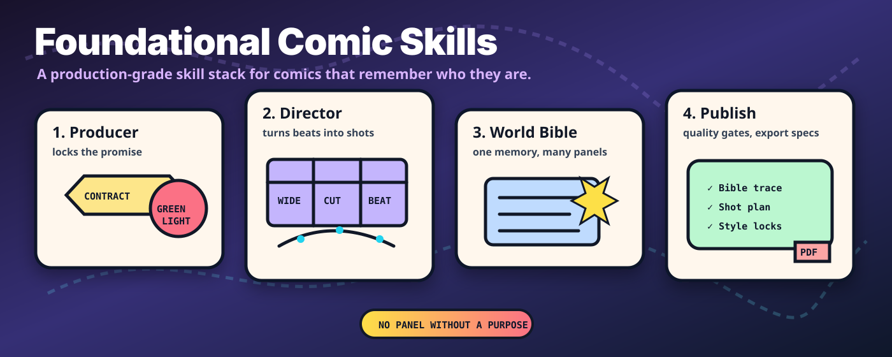
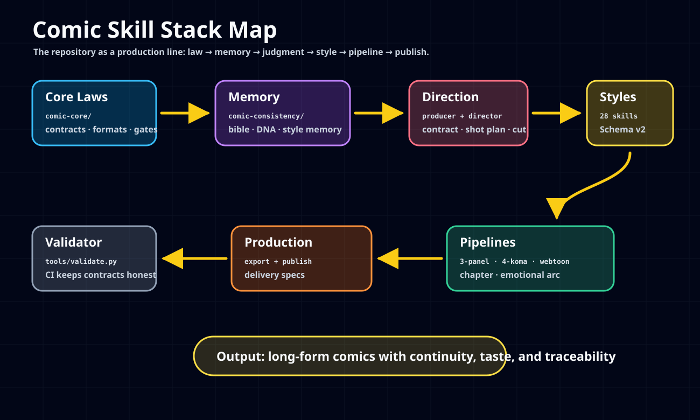

# foundational-comic-skills

<p align="center">
  
</p>

**A production-grade, modular skill system for consistent, long-form comic generation.**

`foundational-comic-skills` is the comic-making operating system for Hermes agents and LLM creative pipelines. It gives agents the missing studio discipline: a Producer locks the promise, a Director plans the shots, a World Bible protects continuity, style skills enforce visual grammar, and validators keep the whole stack honest.

> **Studio law:** no panel without a purpose, no character without a bible, no style without locks, no generation without direction.

[](https://github.com/ObliviousOdin/foundational-comic-skills/actions/workflows/validate.yml)
[](LICENSE)

---

## What You Can Build

| Build | Use these layers | Output |
| --- | --- | --- |
| **A 3-panel joke strip** | Producer → Director → 3-panel pipeline → one style | Tight setup / reinforce / turnaround strip |
| **A 4-koma gag** | Format library → 4-koma pipeline → lettering gates | Vertical rhythm with kishōtenketsu timing |
| **A webtoon scroll segment** | World Bible → emotional arc → webtoon pipeline | Mobile-first sequence with continuity |
| **A long serialized chapter** | World Bible → character DNA → style memory → chapter pipeline | Multi-page output with traceable canon |
| **A style-controlled art pack** | Schema v2 style skills → prompt assembly → quality gates | Consistent visual language across generations |

---

## Make a Comic in 10 Minutes

### 1. Clone

```bash
git clone https://github.com/ObliviousOdin/foundational-comic-skills.git
cd foundational-comic-skills
```

### 2. Validate the studio floor

```bash
python3 tools/validate.py
```

Expected:

```text
Checked 56 skills (30 styles).
All repository contracts hold.
```

Authoring a single style? Skip the full sweep:

```bash
python3 tools/validate.py --style comic-styles/noir/noir-expressionist-comic/SKILL.md
python3 tools/validate.py --bible examples/rabot-strip-001/world-bible.yaml
```

### 3. Start with the worked example

Read the full production walkthrough:

```text
examples/rabot-strip-001/WALKTHROUGH.md
```

It shows one strip traveling through the complete system:

```text
brief → production contract → shot plan → assembled prompt → RETAKE → sign-off
```

### 4. Use the best-practice prompt

```text
Using the foundational comic skills stack, create a 3-panel comic strip.

Project: [series/title]
Audience: [reader]
Format: 3-panel horizontal
Narrative pattern: setup → reinforce → turnaround
Style: [choose from comic-styles]
Characters: [2–4 short descriptions]
World rules: [canon constraints]

Please run the stack in order:
1. Producer locks the production brief.
2. Director creates a shot plan.
3. World Bible / character DNA checks continuity.
4. Style skill injects style locks and negative locks.
5. Pipeline assembles the final panel prompts.
6. Quality gates return PASS / RETAKE decisions.
```

---

## Choose Your Path

| If you are... | Start here | Why |
| --- | --- | --- |
| **New to the repo** | [`examples/rabot-strip-001/WALKTHROUGH.md`](examples/rabot-strip-001/WALKTHROUGH.md) | Fastest way to understand the complete loop |
| **Building a series** | [`comic-consistency/comic-world-bible-system/SKILL.md`](comic-consistency/comic-world-bible-system/SKILL.md) | Canon, characters, locations, negative prompts |
| **Choosing a look** | [`comic-styles/SKILL.md`](comic-styles/SKILL.md) | 28 production-grade Schema v2 style skills |
| **Directing panels** | [`comic-direction/comic-director/SKILL.md`](comic-direction/comic-director/SKILL.md) | Shot size, camera, staging, pacing, final cut |
| **Shipping output** | [`comic-production/comic-export-and-publish/SKILL.md`](comic-production/comic-export-and-publish/SKILL.md) | Export specs, delivery contracts, publish checks |
| **Contributing styles** | [`CONTRIBUTING.md`](CONTRIBUTING.md) | Schema v2 requirements and validator rules |

---

## Visual System Map

<p align="center">
  
</p>

More visual notes live in [`docs/showcase/README.md`](docs/showcase/README.md).

---

## Style Gallery Reel

One scene — a robot artist holding up a finished page at midnight — re-rendered through six of the repo's locked style contracts. Same shot plan, same world bible, six different visual grammars. That is the whole thesis of `comic-styles/`: **style is a contract, not a vibe.**

<p align="center">
  
</p>

Every frame above is drawn from the actual **Prompt Block** and **Style Quality Gates** of its skill:

| Frame | Style skill | Signature locks honored |
| --- | --- | --- |
| 1 | [`golden-age-superhero-comic`](comic-styles/western/golden-age-superhero-comic/SKILL.md) | Four-color flats, Ben-Day dots, heavy uniform outlines, yellow caption box, burst balloon |
| 2 | [`manhwa-color-webtoon`](comic-styles/asian/manhwa-color-webtoon/SKILL.md) | Teal ambient vs warm key light, soft glow, clean closed lineart |
| 3 | [`ligne-claire-franco-belge`](comic-styles/european/ligne-claire-franco-belge/SKILL.md) | One line weight everywhere, flat color zones, no cast shadows |
| 4 | [`gekiga-cinematic-manga`](comic-styles/manga/gekiga-cinematic-manga/SKILL.md) | B&W, crosshatch tension, spot blacks by luminance |
| 5 | [`cyberpunk-sci-fi-comic`](comic-styles/sci-fi/cyberpunk-sci-fi-comic/SKILL.md) | ≤3 neon accents, one readable sign, sourced rim light, scanlines |
| 6 | [`watercolor-storybook-comic`](comic-styles/decorative/watercolor-storybook-comic/SKILL.md) | Soft blooms, paper grain, hand-wobbled border, reserved highlights |

---

## The Pattern, Performed

The repo's flagship narrative pattern — `setup → reinforce → turnaround` — demonstrated as an animated three-panel strip about what happens when you generate without direction:

<p align="center">
  
</p>

Panel 1 is every undirected prompt. Panel 2 is what you get. Panel 3 is why [`comic-producer`](comic-direction/comic-producer/SKILL.md) and [`comic-director`](comic-direction/comic-director/SKILL.md) exist.

---

## The Stack in One Sentence

`comic-core` defines the laws, `comic-consistency` is memory, `comic-direction` is judgment, `comic-styles` is visual grammar, `comic-pipeline` turns decisions into output, and `comic-production` ships the result.

---

## Core Philosophy

The repository is built around one production belief:

> **Every consistency decision must trace back to a single, versioned source of truth — and every creative decision must be made before generation by a role with authority to make it.**

The **World Bible** is the central nervous system. It holds canon, character DNA, locations, reference rules, negative prompts, and consistency configuration.

The **Direction Layer** is the taste engine. The Producer locks what is being made. The Director decides how each panel reads before generation starts.

The **Validator** is the studio safety rail. It prevents the repo from drifting into vague prompts, broken references, or uncheckable style contracts.

---

## Direction Layer: Producer + Director

The biggest failure mode in AI comics is not only inconsistency. It is the absence of decisions.

| Role | Authority | Key artifacts |
| --- | --- | --- |
| [`comic-producer`](comic-direction/comic-producer/SKILL.md) | What gets made, why it exists, when it ships | `production-brief.yaml`, contract, greenlight gate, sign-off |
| [`comic-director`](comic-direction/comic-director/SKILL.md) | How it looks and reads panel by panel | vision statement, shot plan, final cut verdicts |

Every serious run follows this studio chain:

```text
Producer locks the contract
→ Director plans the shots
→ Consistency stack checks canon
→ Style skill injects visual grammar
→ Pipeline assembles output
→ Director cuts: flow → words → everything → Artistic Life
→ Producer signs off
```

---

## Variation Engine: Formats × Patterns × Styles

A project composes one choice from each library. The Producer locks those choices before generation.

| Library | Options |
| --- | --- |
| [`comic-format-library`](comic-core/comic-format-library/SKILL.md) | 3-panel horizontal, 4-koma vertical, webtoon scroll, single-panel gag, 2×2 grid, multi-page chapter |
| [`comic-narrative-patterns`](comic-core/comic-narrative-patterns/SKILL.md) | setup→reinforce→turnaround, kishōtenketsu, gag escalation, slow-burn reveal, parallel action, silent strip |
| [`comic-styles/`](comic-styles/SKILL.md) | 28 style skills across 12 categories |
| [`comic-pipeline/`](comic-pipeline/SKILL.md) | 3-panel, 4-koma, webtoon scroll, multi-page chapter, emotional arc orchestration |

---

## Primary Skill: `comic-world-bible-system`

This is the foundational consistency skill. All long-form work should start here.

### Best-practice prompt template

```text
Using the `comic-world-bible-system` skill, create a production-ready world bible for a new comic series.

Project name: [Your Series Name]
Target length: [e.g. 500–1000+ panels]
Style direction: [e.g. retro hand-inked manga with gekiga influences]
Main characters: [List 2–4 characters with brief descriptions]
Key locations: [List recurring environments]
Special requirements: [Any constraints, motifs, or themes]

Please:
1. Generate a complete `world-bible.yaml` following the schema.
2. Create the corresponding folder structure.
3. Generate initial DNA templates for each character.
4. Provide the negative prompt library.
5. Output the recommended consistency configuration.
```

Expected artifacts:

- validated `world-bible.yaml`
- character DNA templates
- negative prompt library
- style memory entries
- prompt assembly blocks
- generation log metadata

---

## Repository Structure

```text
foundational-comic-skills/
├── README.md / CONTRIBUTING.md / CHANGELOG.md
├── tools/validate.py              # repo validator — run before every commit
├── .github/workflows/validate.yml # CI validator on push/PR
├── docs/                          # visual showcase and operator-facing docs
├── comic-core/                    # laws: contracts, gates, patterns, formats, lettering
├── comic-consistency/             # memory: world bible, DNA, style memory, orchestration
├── comic-direction/               # judgment: Producer + Director
├── comic-styles/                  # 28 Schema v2 style skills across 12 categories
├── comic-pipeline/                # workflows: strips, 4-koma, webtoon, chapters, arcs
├── comic-production/              # delivery: export and publish specs
├── examples/                      # complete worked projects
├── research/                      # research mapped to enforcing skills
├── skills/                        # original portable harness pack
└── exports/                       # generated artifacts; derived, not hand-edited
```

---

## Best Practices

1. **Always start with a World Bible.** Long-form consistency begins with canon, not prompt vibes.
2. **Version everything.** Bible, DNA, style memory, production brief, shot plan, and final prompts are source artifacts.
3. **Derive, do not duplicate.** Character DNA, model sheet prompts, and negative libraries should derive from the bible.
4. **Lock the contract before the first panel.** Format, narrative pattern, style, scope, and success criteria must be explicit.
5. **No generation without a shot plan.** Re-rolling without direction is gambling, not directing.
6. **Use layered conditioning.** Combine bible constraints, DNA, style memory, negative locks, and quality gates.
7. **Escalate canon conflicts.** If the bible and prompt disagree, stop and ask for a creative decision.
8. **Use RETAKE as a feature.** A failed panel should return a precise reason and a revised instruction, not vague disappointment.

---

## Sustainability

The repository enforces its own discipline:

- **Agent load order:** [`docs/AGENT-INTEGRATION.md`](docs/AGENT-INTEGRATION.md) states what an agent reads, in what order, and which layer wins when two disagree — a permission never overrides a lock.
- **Validator:** `python3 tools/validate.py` checks frontmatter, Schema v2, style-index sync, cross-reference resolution, native-habitat routing, world-bible provenance, and YAML health. `--style` and `--bible` narrow it to one file.
- **Prompt Block trust boundary:** style fragments reach a generation backend verbatim, so the validator holds them to a 40–90 word budget, rejects injection surfaces (pronouns, imperatives, meta-instruction tokens, story content, quoted copy), and fails any two styles that collapse into the same fragment. See [`CONTRIBUTING.md`](CONTRIBUTING.md).
- **CI:** `.github/workflows/validate.yml` runs the validator *and* the test suite on every push and PR.
- **Schema v2:** every style skill includes negative locks, prompt blocks, direction notes, consistency notes, and style-specific gates.
- **Traceability:** `research/README.md` maps every research finding to the skill that enforces it.
- **Examples:** `examples/rabot-strip-001/` demonstrates how production artifacts connect.

---

## Research Foundation

Every serious claim in this repo should become an enforcing skill or stay in research until it does.

| Document | Focus | Path |
| --- | --- | --- |
| Advanced Consistency Systems | IP-Adapter, InstantID, LoRA orchestration, world bible architecture | [`research/ADVANCED-CONSISTENCY-SYSTEMS.md`](research/ADVANCED-CONSISTENCY-SYSTEMS.md) |
| Style-Specific Technical Mastery | Screentone simulation, ligne claire, gekiga framing, ink physics | [`research/STYLE-SPECIFIC-TECHNICAL-MASTERY.md`](research/STYLE-SPECIFIC-TECHNICAL-MASTERY.md) |
| Comic Art Evaluation Frameworks | Professional rubrics, failure modes, human vs AI signals | [`research/COMIC-ART-EVALUATION-FRAMEWORKS.md`](research/COMIC-ART-EVALUATION-FRAMEWORKS.md) |
| Artistic Decision-Making Process Modeling | Micro-decisions, PINS model, manga *name* systems | [`research/ARTISTIC-DECISION-MAKING-PROCESS-MODELING.md`](research/ARTISTIC-DECISION-MAKING-PROCESS-MODELING.md) |
| Panel Composition Theory | McCloud transitions, gutters, Golden Ratio, eyelines | [`research/PANEL-COMPOSITION-THEORY.md`](research/PANEL-COMPOSITION-THEORY.md) |
| Comic Timing and Pacing | Setup–reinforce–turnaround, gutter rhythm | [`research/COMIC-TIMING-AND-PACING.md`](research/COMIC-TIMING-AND-PACING.md) |

---

## Contributing

Run the full local gate before opening a PR:

```bash
python3 tools/validate.py
python3 -m pytest tests/ -q
git diff --check
```

When adding style skills, follow [`CONTRIBUTING.md`](CONTRIBUTING.md) and keep Schema v2 sections in order.

---

## Goals

- Provide a single source of truth for long-form comic consistency.
- Make every creative decision explicit, owned, and made before generation.
- Enable derivable, versioned consistency artifacts.
- Support disciplined variation: formats × narrative patterns × 28 styles.
- Give Hermes agents and other LLM pipelines clear, structured comic skills.
- Bridge research and production with practical, validator-backed systems.

---

*Last updated: June 2026*  
*Maintained by ObliviousOdin · [MIT License](LICENSE)*
